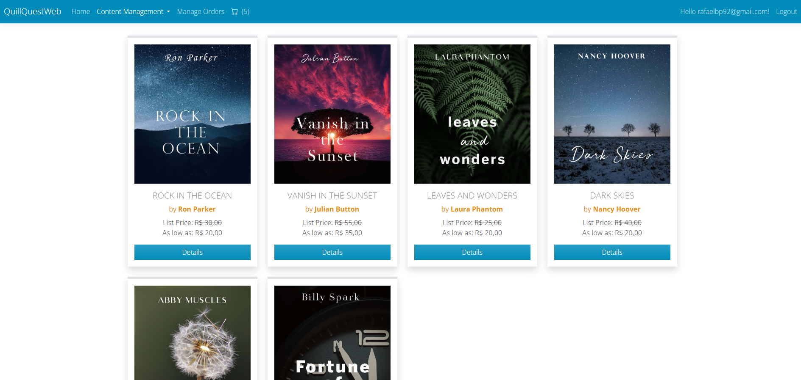
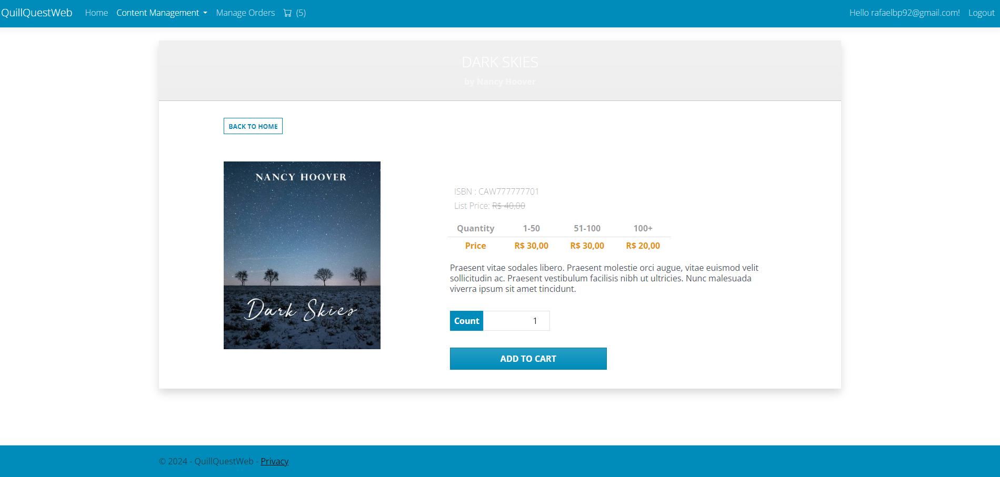
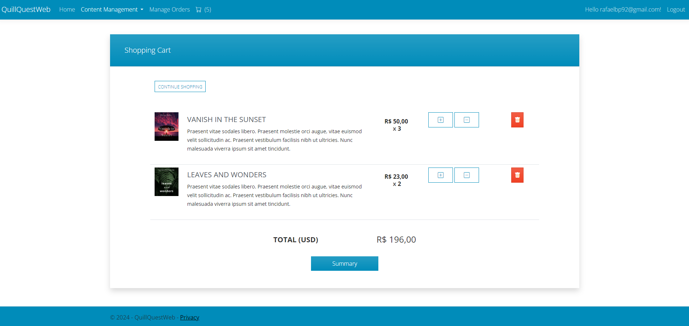
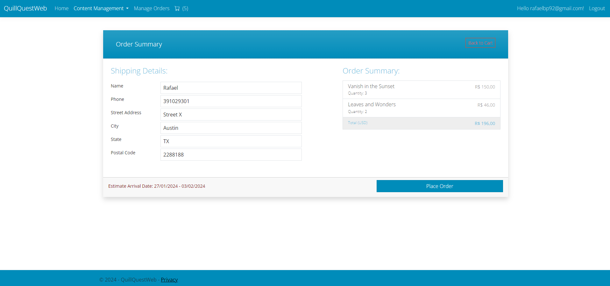
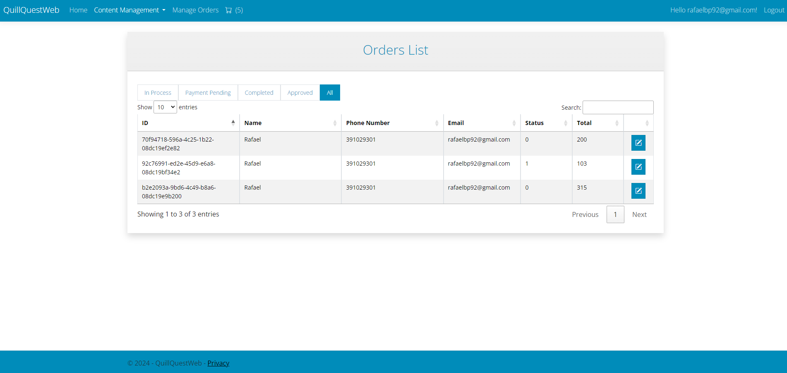
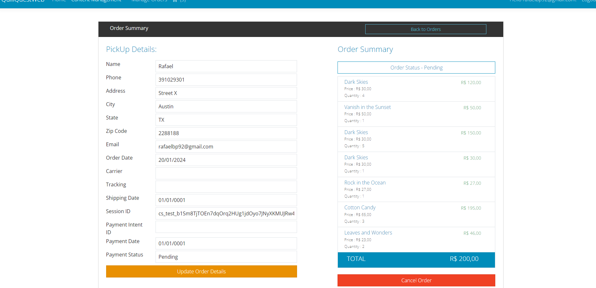

# QuillQuest - BookStore Web Application

This is a Web application developed to undestand and apply the **.NET MVC Core** concepts using **C#** as progamming language
The application is a fake book store where is also possible to manage the products available in the store

The concepts and libraries used are:

- Entity Framework
- MVC
- Repositories pattern
- Unit of Work Pattern
- Identity
- Stripe (Payment)
- Datatables
- jQuery
- Boostrap
- TinyMCE (WYSIWYG HTML editor https://www.tiny.cloud/)
- Sweet Alert 2 (https://sweetalert2.github.io/)

